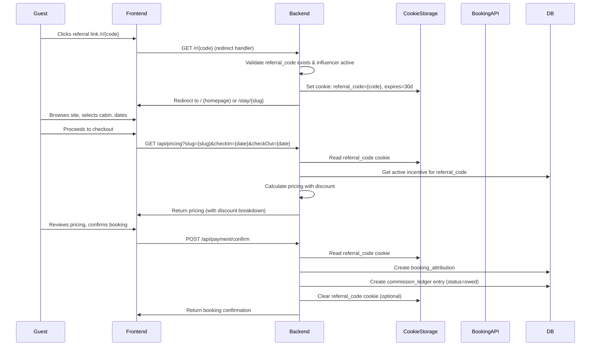

# Affiliate / Influencer Marketing Tool - Design Document

## 1. Overview / Goals

Build an MVP affiliate/influencer marketing system that enables Luminary Resorts to:
- Track referrals from influencers/affiliates
- Automatically apply guest discounts during checkout
- Calculate and track influencer commissions
- Generate reports for influencer payouts
- Send reports to influencers via email

**Core Value**: Enable scalable influencer partnerships with automated tracking, discount application, and commission management.

**Success Metrics**:
- Number of active influencers
- Bookings attributed to referrals
- Revenue generated through affiliate channel
- Commission payout accuracy

## 2. Non-goals (MVP Exclusions)

**Explicitly NOT included in MVP**:
- Influencer self-service portal (influencers cannot log in to view their stats)
- Automated payout processing (manual payout tracking only)
- Multi-campaign support (one active incentive per influencer)
- A/B testing of referral links
- Real-time analytics dashboard
- Referral link expiration/revocation (links remain active until influencer is deactivated)
- Commission tiers based on booking volume
- Split commissions between multiple influencers
- Guest referral program (only influencer referrals)
- Social media integration (manual entry of handles)
- Automated influencer discovery/onboarding

## 3. User Roles & Permissions

### Roles

1. **Owner** (`yunhang.chen@gmail.com` - hardcoded)
   - Full access to all features
   - Can approve/reject admin users
   - Can modify any influencer/incentive
   - Can view all reports

2. **Admin**
   - Can manage influencers (CRUD)
   - Can configure incentives
   - Can generate and send reports
   - Cannot approve other admins (owner-only)
   - Cannot modify owner account

3. **Member**
   - Can view influencers list
   - Can view reports (read-only)
   - Cannot create/edit influencers
   - Cannot configure incentives
   - Cannot send reports

### Approval Workflow

1. User signs in with Google OAuth
2. System checks if email exists in `admin_users` table
3. If not found:
   - User sees "Pending Approval" screen
   - Owner receives notification (email or in-app)
4. Owner approves/rejects via admin panel
5. Upon approval:
   - User role is set (admin or member)
   - User can access admin portal
6. Rejected users remain in "pending" state

**Approval States**:
- `pending` - Awaiting owner approval
- `approved` - Active user
- `rejected` - Access denied
- `suspended` - Temporarily disabled (owner/admin can suspend)

## 4. User Stories

### Team Member (Admin)
- As an admin, I want to add a new influencer with their contact information so we can track their referrals
- As an admin, I want to generate a unique referral link for an influencer so they can share it with their audience
- As an admin, I want to configure discount and commission rates for an influencer so we can set appropriate incentives
- As an admin, I want to view a report of all bookings attributed to an influencer so I can track their performance
- As an admin, I want to send a report to an influencer via email so they can see their earnings

### Owner
- As the owner, I want to approve or reject new admin users so I can control access to the admin portal
- As the owner, I want to view all influencer reports across all admins so I can monitor the affiliate program
- As the owner, I want to modify any influencer's incentives so I can adjust commission structures

### Influencer (External)
- As an influencer, I receive a unique referral link that I can share with my audience
- As an influencer, I receive periodic email reports showing my bookings and commission owed

### Guest (End User)
- As a guest, I click an influencer's referral link and see the normal booking flow
- As a guest, I receive a discount automatically applied during checkout (transparent to me)
- As a guest, my booking is attributed to the influencer who shared the link

## 5. UX / Screens

### 5.1 `/admin` Login & Pending Approval

**Route**: `/admin/login` (or redirect from `/admin` if not authenticated)

**Screen**: Google OAuth login button
- "Sign in with Google"
- After OAuth, redirect to `/admin/pending` if status is `pending`
- Redirect to `/admin/dashboard` if `approved`

**Pending Approval Screen** (`/admin/pending`):
- Message: "Your account is pending approval from the owner"
- Contact information
- Logout button

### 5.2 Admin Dashboard (`/admin/dashboard`)

**Layout**: Sidebar navigation + main content area

**Sidebar**:
- Dashboard (overview stats)
- Influencers
- Reports
- Users (owner only - for approval)
- Settings (owner only)

**Main Content**:
- Quick stats cards:
  - Total active influencers
  - Bookings this month (attributed)
  - Revenue this month (attributed)
  - Pending approvals (owner only)

### 5.3 Influencers List (`/admin/influencers`)

**Table View**:
- Columns: Name, Email, Status, Active Link, Bookings (count), Commission Owed, Actions
- Search/filter by name, email, status
- "Add Influencer" button (top right)

**Status Badges**:
- Active (green)
- Inactive (gray)
- Pending Setup (yellow - no incentive configured)

### 5.4 Create/Edit Influencer (`/admin/influencers/new`, `/admin/influencers/[id]/edit`)

**Form Fields**:
- Name* (text)
- Email* (email)
- Phone (text, optional)
- Instagram Handle (text, optional)
- TikTok Handle (text, optional)
- Notes (textarea, optional)
- Status (dropdown: Active / Inactive)

**After Save**:
- Show generated referral link
- Show QR code (downloadable PNG)
- Link to configure incentives

### 5.5 Incentive Configuration (`/admin/influencers/[id]/incentives`)

**Form Fields**:
- Guest Discount Type* (radio: Percent / Fixed Amount)
- Guest Discount Value* (number)
- Influencer Commission Type* (radio: Percent / Fixed Amount)
- Influencer Commission Value* (number)
- Effective Date Range:
  - Start Date (date picker, optional)
  - End Date (date picker, optional)
- Notes (textarea, optional)

**Validation**:
- Percent: 0-100
- Fixed Amount: >= 0
- End date must be after start date
- At least one active incentive required for link to work

**Display**:
- Current active incentive (if exists)
- History of past incentives (read-only)

### 5.6 Link + QR Display (`/admin/influencers/[id]`)

**Link Section**:
- Full URL: `https://luminaryresorts.com/r/{code}`
- Copy button
- QR code image (PNG, downloadable)
- Link statistics (optional MVP: click count, last clicked)

**QR Code**:
- Generate server-side using library (e.g., `qrcode` npm package)
- Store as base64 or generate on-demand
- Download as PNG button

### 5.7 Reports Page (`/admin/reports`)

**Filters**:
- Influencer (dropdown, "All" default)
- Date Range (start date, end date)
- Status (dropdown: All / Pending / Confirmed / Paid / Cancelled)

**Table Columns**:
- Booking Date
- Guest Name
- Cabin
- Check-in / Check-out
- Revenue (subtotal)
- Guest Discount Applied
- Commission Owed
- Commission Status
- Actions (View Details, Mark as Paid)

**Actions**:
- "Generate Report" button (applies filters, shows results)
- "Export CSV" button
- "Send to Influencer" button (email with report)

**Report Detail Modal**:
- Full booking details
- Pricing breakdown
- Discount applied
- Commission calculation
- Payment status

## 6. Data Model

### 6.1 Database Schema

```sql
-- Admin Users (authentication + authorization)
CREATE TABLE admin_users (
  id UUID PRIMARY KEY DEFAULT gen_random_uuid(),
  email VARCHAR(255) UNIQUE NOT NULL,
  name VARCHAR(255),
  google_id VARCHAR(255) UNIQUE,
  role VARCHAR(20) NOT NULL DEFAULT 'member' CHECK (role IN ('owner', 'admin', 'member')),
  approval_status VARCHAR(20) NOT NULL DEFAULT 'pending' CHECK (approval_status IN ('pending', 'approved', 'rejected', 'suspended')),
  approved_by UUID REFERENCES admin_users(id),
  approved_at TIMESTAMP WITH TIME ZONE,
  created_at TIMESTAMP WITH TIME ZONE NOT NULL DEFAULT NOW(),
  updated_at TIMESTAMP WITH TIME ZONE NOT NULL DEFAULT NOW(),
  last_login_at TIMESTAMP WITH TIME ZONE
);

CREATE INDEX idx_admin_users_email ON admin_users(email);
CREATE INDEX idx_admin_users_approval_status ON admin_users(approval_status);
CREATE INDEX idx_admin_users_role ON admin_users(role);

-- Influencers
CREATE TABLE influencers (
  id UUID PRIMARY KEY DEFAULT gen_random_uuid(),
  name VARCHAR(255) NOT NULL,
  email VARCHAR(255),
  phone VARCHAR(50),
  instagram_handle VARCHAR(100),
  tiktok_handle VARCHAR(100),
  notes TEXT,
  status VARCHAR(20) NOT NULL DEFAULT 'active' CHECK (status IN ('active', 'inactive')),
  referral_code VARCHAR(50) UNIQUE NOT NULL, -- e.g., "inf_abc123xyz"
  created_by UUID NOT NULL REFERENCES admin_users(id),
  created_at TIMESTAMP WITH TIME ZONE NOT NULL DEFAULT NOW(),
  updated_at TIMESTAMP WITH TIME ZONE NOT NULL DEFAULT NOW()
);

CREATE INDEX idx_influencers_referral_code ON influencers(referral_code);
CREATE INDEX idx_influencers_status ON influencers(status);
CREATE INDEX idx_influencers_email ON influencers(email);

-- Incentive Rules (one active per influencer, with history)
CREATE TABLE incentive_rules (
  id UUID PRIMARY KEY DEFAULT gen_random_uuid(),
  influencer_id UUID NOT NULL REFERENCES influencers(id) ON DELETE CASCADE,
  guest_discount_type VARCHAR(20) NOT NULL CHECK (guest_discount_type IN ('percent', 'fixed')),
  guest_discount_value DECIMAL(10, 2) NOT NULL CHECK (guest_discount_value >= 0),
  influencer_commission_type VARCHAR(20) NOT NULL CHECK (influencer_commission_type IN ('percent', 'fixed')),
  influencer_commission_value DECIMAL(10, 2) NOT NULL CHECK (influencer_commission_value >= 0),
  effective_start_date DATE,
  effective_end_date DATE,
  is_active BOOLEAN NOT NULL DEFAULT true,
  notes TEXT,
  created_by UUID NOT NULL REFERENCES admin_users(id),
  created_at TIMESTAMP WITH TIME ZONE NOT NULL DEFAULT NOW(),
  updated_at TIMESTAMP WITH TIME ZONE NOT NULL DEFAULT NOW(),
  
  -- Ensure only one active incentive per influencer
  CONSTRAINT unique_active_incentive UNIQUE NULLS NOT DISTINCT (influencer_id, is_active) WHERE is_active = true
);

CREATE INDEX idx_incentive_rules_influencer_id ON incentive_rules(influencer_id);
CREATE INDEX idx_incentive_rules_active ON incentive_rules(influencer_id, is_active) WHERE is_active = true;
CREATE INDEX idx_incentive_rules_dates ON incentive_rules(effective_start_date, effective_end_date);

-- Booking Attribution (links bookings to influencers)
CREATE TABLE booking_attributions (
  id UUID PRIMARY KEY DEFAULT gen_random_uuid(),
  booking_id UUID NOT NULL REFERENCES bookings(id) ON DELETE CASCADE,
  influencer_id UUID NOT NULL REFERENCES influencers(id),
  referral_code VARCHAR(50) NOT NULL, -- Snapshot at time of booking
  guest_discount_applied DECIMAL(10, 2) NOT NULL DEFAULT 0,
  guest_discount_type VARCHAR(20) NOT NULL, -- Snapshot
  commission_owed DECIMAL(10, 2) NOT NULL DEFAULT 0,
  commission_type VARCHAR(20) NOT NULL, -- Snapshot
  revenue_basis DECIMAL(10, 2) NOT NULL, -- Subtotal used for commission calculation
  created_at TIMESTAMP WITH TIME ZONE NOT NULL DEFAULT NOW(),
  
  UNIQUE(booking_id) -- One influencer per booking
);

CREATE INDEX idx_booking_attributions_booking_id ON booking_attributions(booking_id);
CREATE INDEX idx_booking_attributions_influencer_id ON booking_attributions(influencer_id);
CREATE INDEX idx_booking_attributions_created_at ON booking_attributions(created_at);

-- Commission Ledger (tracks owed vs paid)
CREATE TABLE commission_ledger (
  id UUID PRIMARY KEY DEFAULT gen_random_uuid(),
  booking_attribution_id UUID NOT NULL REFERENCES booking_attributions(id) ON DELETE CASCADE,
  influencer_id UUID NOT NULL REFERENCES influencers(id),
  amount DECIMAL(10, 2) NOT NULL,
  status VARCHAR(20) NOT NULL DEFAULT 'owed' CHECK (status IN ('owed', 'paid', 'cancelled')),
  paid_at TIMESTAMP WITH TIME ZONE,
  paid_by UUID REFERENCES admin_users(id),
  payout_notes TEXT,
  created_at TIMESTAMP WITH TIME ZONE NOT NULL DEFAULT NOW(),
  updated_at TIMESTAMP WITH TIME ZONE NOT NULL DEFAULT NOW()
);

CREATE INDEX idx_commission_ledger_attribution_id ON commission_ledger(booking_attribution_id);
CREATE INDEX idx_commission_ledger_influencer_id ON commission_ledger(influencer_id);
CREATE INDEX idx_commission_ledger_status ON commission_ledger(status);

-- Audit Log (minimal - who changed incentives)
CREATE TABLE incentive_audit_log (
  id UUID PRIMARY KEY DEFAULT gen_random_uuid(),
  influencer_id UUID NOT NULL REFERENCES influencers(id),
  incentive_rule_id UUID REFERENCES incentive_rules(id),
  action VARCHAR(50) NOT NULL, -- 'created', 'updated', 'deactivated'
  changed_by UUID NOT NULL REFERENCES admin_users(id),
  changes JSONB, -- Snapshot of old vs new values
  created_at TIMESTAMP WITH TIME ZONE NOT NULL DEFAULT NOW()
);

CREATE INDEX idx_incentive_audit_log_influencer_id ON incentive_audit_log(influencer_id);
CREATE INDEX idx_incentive_audit_log_created_at ON incentive_audit_log(created_at);
```

### 6.2 Key Fields Explanation

**`influencers.referral_code`**:
- Format: `inf_{randomAlphanumeric(12)}`
- Example: `inf_aB3xY9mK2pQ7`
- Generated on influencer creation, never changes
- Used in referral URL: `/r/{code}`

**`incentive_rules`**:
- Only one `is_active = true` per influencer (enforced by constraint)
- When updating, deactivate old rule, create new one (maintains history)
- Date ranges are optional (null = no expiration)

**`booking_attributions`**:
- Snapshot of discount/commission values at booking time (prevents changes affecting past bookings)
- `revenue_basis`: Subtotal before discount (used for commission calculation)

**`commission_ledger`**:
- One entry per booking attribution
- Status transitions: `owed` → `paid` (or `cancelled` if booking cancelled)
- `payout_notes`: Free-form text for payment reference, check number, etc.

## 7. Referral Tracking + Discount Application Flow

### 7.1 Referral Link Format

**URL Pattern**: `https://luminaryresorts.com/r/{referral_code}`

**Example**: `https://luminaryresorts.com/r/inf_aB3xY9mK2pQ7`

### 7.2 Attribution Flow



### 7.3 Cookie/Storage Strategy

**Cookie Name**: `luminary_referral`

**Cookie Value**: `{referral_code}`

**Attributes**:
- `HttpOnly`: false (needed for client-side reading)
- `Secure`: true (HTTPS only)
- `SameSite`: Lax
- `Max-Age`: 30 days (2,592,000 seconds)
- `Path`: `/`

**Fallback**: If cookies disabled, use `localStorage` (client-side only)

**Server-Side Reading**: Middleware reads cookie on each request, passes to API routes via request context

### 7.4 Discount Application (Server-Side Authority)

**Pricing Calculation Flow** (`/api/pricing`):

1. Calculate base pricing (existing logic)
2. Check for `referral_code` in cookie/query param
3. If present:
   - Query `incentive_rules` for active incentive
   - Validate date range (if specified)
   - Apply guest discount:
     - **Percent**: `discounted_subtotal = subtotal * (1 - discount_value / 100)`
     - **Fixed**: `discounted_subtotal = MAX(0, subtotal - discount_value)`
   - Recalculate tax on discounted subtotal
   - Return pricing with discount breakdown:
     ```json
     {
       "subtotal": 1000.00,
       "discount": {
         "type": "percent",
         "value": 10.00,
         "amount": 100.00
       },
       "discounted_subtotal": 900.00,
       "cleaningFee": 100.00,
       "tax": 108.00, // 12% of 900
       "channelFee": 18.00, // 2% of 900
       "total": 1126.00
     }
     ```

**Security**: 
- Discount calculation happens **server-side only**
- Client cannot modify discount amount
- Referral code validated against database
- Incentive rules checked for active status and date range

### 7.5 Attribution Window

**Default**: 30 days from link click

**Implementation**:
- Cookie expires after 30 days
- If user returns within 30 days and books, attribution applies
- If user clears cookies, attribution lost (acceptable for MVP)

**Future Enhancement**: Extend window or use server-side session tracking

### 7.6 Preventing Tampering

1. **Referral Code Validation**:
   - Server validates code exists in database
   - Server checks influencer is active
   - Server checks incentive is active and within date range

2. **Discount Calculation**:
   - All calculations server-side
   - Client receives final pricing only
   - Payment intent amount matches server-calculated total

3. **Booking Attribution**:
   - Attribution created server-side during payment confirmation
   - Uses server-read cookie value (not client-provided)
   - Snapshot of incentive values stored at booking time

4. **Link Token Security**:
   - Referral codes are random, unguessable (12+ alphanumeric)
   - No sequential IDs or predictable patterns
   - Codes never exposed in client-side JavaScript (only in URL/cookie)

## 8. Integration Touchpoints (Hostaway API)

### 8.1 Booking Storage

**Existing Flow** (from `lib/booking-operations.ts`):
1. Payment confirmed via Stripe
2. Create Hostaway reservation via API (`/reservations`)
3. Store booking in local `bookings` table with `hostaway_reservation_id`

**New Addition**: After step 3, create `booking_attribution` record

### 8.2 Commission Status Lifecycle

**Status Transitions**:

1. **`owed`** (default):
   - Set when booking is created and payment succeeds
   - Commission calculated and stored in `commission_ledger`

2. **`confirmed`** (optional MVP enhancement):
   - After check-in date passes (prevents commission on no-shows)
   - Or after cancellation window (e.g., 48 hours before check-in)
   - **MVP**: Skip this, use `owed` → `paid` directly

3. **`paid`**:
   - Admin marks commission as paid
   - `paid_at` timestamp set
   - `paid_by` admin user ID recorded
   - `payout_notes` optional (check number, payment method, etc.)

4. **`cancelled`**:
   - If booking is cancelled, commission status set to `cancelled`
   - Commission amount remains in ledger for audit trail

### 8.3 Hostaway Reservation ID

**Storage**: `bookings.hostaway_reservation_id` (already exists)

**Usage**: 
- Link booking attribution to Hostaway reservation for reconciliation
- Query Hostaway API for reservation status changes (future enhancement)

**MVP**: No automatic status sync - manual reconciliation only

## 9. API Design (Internal Endpoints)

### 9.1 Authentication & Authorization

**Base Path**: `/api/admin/*`

**Middleware**: All routes require:
1. Valid session (NextAuth or custom session)
2. User exists in `admin_users` table
3. `approval_status = 'approved'`
4. Role-based authorization checks

### 9.2 Influencer CRUD

#### `GET /api/admin/influencers`
**Auth**: Admin, Owner

**Query Params**:
- `status`: `active` | `inactive` | `all` (default: `all`)
- `search`: string (name/email search)
- `page`: number (default: 1)
- `limit`: number (default: 50)

**Response**:
```json
{
  "influencers": [
    {
      "id": "uuid",
      "name": "John Doe",
      "email": "john@example.com",
      "phone": "+1234567890",
      "instagram_handle": "@johndoe",
      "tiktok_handle": "@johndoe",
      "status": "active",
      "referral_code": "inf_aB3xY9mK2pQ7",
      "referral_link": "https://luminaryresorts.com/r/inf_aB3xY9mK2pQ7",
      "has_active_incentive": true,
      "bookings_count": 5,
      "commission_owed": 250.00,
      "created_at": "2024-01-15T10:00:00Z"
    }
  ],
  "pagination": {
    "page": 1,
    "limit": 50,
    "total": 10,
    "totalPages": 1
  }
}
```

#### `GET /api/admin/influencers/[id]`
**Auth**: Admin, Owner

**Response**:
```json
{
  "id": "uuid",
  "name": "John Doe",
  "email": "john@example.com",
  "phone": "+1234567890",
  "instagram_handle": "@johndoe",
  "tiktok_handle": "@johndoe",
  "notes": "Travel influencer, 50K followers",
  "status": "active",
  "referral_code": "inf_aB3xY9mK2pQ7",
  "referral_link": "https://luminaryresorts.com/r/inf_aB3xY9mK2pQ7",
  "active_incentive": {
    "id": "uuid",
    "guest_discount_type": "percent",
    "guest_discount_value": 10.00,
    "influencer_commission_type": "percent",
    "influencer_commission_value": 15.00,
    "effective_start_date": "2024-01-01",
    "effective_end_date": null
  },
  "stats": {
    "total_bookings": 5,
    "total_revenue": 5000.00,
    "total_commission_owed": 250.00,
    "total_commission_paid": 100.00
  },
  "created_at": "2024-01-15T10:00:00Z",
  "updated_at": "2024-01-20T15:30:00Z"
}
```

#### `POST /api/admin/influencers`
**Auth**: Admin, Owner

**Request Body**:
```json
{
  "name": "John Doe",
  "email": "john@example.com",
  "phone": "+1234567890",
  "instagram_handle": "@johndoe",
  "tiktok_handle": "@johndoe",
  "notes": "Travel influencer",
  "status": "active"
}
```

**Response**: Same as `GET /api/admin/influencers/[id]`

#### `PATCH /api/admin/influencers/[id]`
**Auth**: Admin, Owner

**Request Body**: Partial update (same fields as POST)

**Response**: Updated influencer object

#### `DELETE /api/admin/influencers/[id]`
**Auth**: Owner only

**Response**:
```json
{
  "success": true,
  "message": "Influencer deleted"
}
```

**Note**: Soft delete recommended (set `status = 'inactive'`) instead of hard delete

### 9.3 Link/QR Generation

#### `GET /api/admin/influencers/[id]/link`
**Auth**: Admin, Owner

**Response**:
```json
{
  "referral_code": "inf_aB3xY9mK2pQ7",
  "referral_link": "https://luminaryresorts.com/r/inf_aB3xY9mK2pQ7",
  "qr_code_data_url": "data:image/png;base64,iVBORw0KGgoAAAANSUhEUgAA..."
}
```

**QR Code**: Generated server-side using `qrcode` npm package, returned as base64 data URL

#### `GET /api/admin/influencers/[id]/qr`
**Auth**: Admin, Owner

**Response**: PNG image (Content-Type: `image/png`)

**Usage**: Direct image download link

### 9.4 Incentive Management

#### `GET /api/admin/influencers/[id]/incentives`
**Auth**: Admin, Owner

**Response**:
```json
{
  "active": {
    "id": "uuid",
    "guest_discount_type": "percent",
    "guest_discount_value": 10.00,
    "influencer_commission_type": "percent",
    "influencer_commission_value": 15.00,
    "effective_start_date": "2024-01-01",
    "effective_end_date": null,
    "is_active": true,
    "created_at": "2024-01-15T10:00:00Z"
  },
  "history": [
    {
      "id": "uuid",
      "guest_discount_type": "fixed",
      "guest_discount_value": 50.00,
      "influencer_commission_type": "percent",
      "influencer_commission_value": 10.00,
      "effective_start_date": "2023-12-01",
      "effective_end_date": "2023-12-31",
      "is_active": false,
      "created_at": "2023-12-01T10:00:00Z"
    }
  ]
}
```

#### `POST /api/admin/influencers/[id]/incentives`
**Auth**: Admin, Owner

**Request Body**:
```json
{
  "guest_discount_type": "percent",
  "guest_discount_value": 10.00,
  "influencer_commission_type": "percent",
  "influencer_commission_value": 15.00,
  "effective_start_date": "2024-01-01",
  "effective_end_date": null,
  "notes": "Q1 2024 campaign"
}
```

**Logic**:
1. Deactivate current active incentive (if exists)
2. Create new incentive with `is_active = true`
3. Log audit entry

**Response**: New incentive object

#### `PATCH /api/admin/influencers/[id]/incentives/[incentiveId]`
**Auth**: Admin, Owner

**Request Body**: Partial update

**Response**: Updated incentive object

### 9.5 Report Generation

#### `GET /api/admin/reports`
**Auth**: Admin, Owner, Member (read-only)

**Query Params**:
- `influencer_id`: UUID (optional)
- `start_date`: ISO date string (optional)
- `end_date`: ISO date string (optional)
- `status`: `all` | `owed` | `paid` | `cancelled` (default: `all`)
- `page`: number (default: 1)
- `limit`: number (default: 50)

**Response**:
```json
{
  "bookings": [
    {
      "id": "uuid",
      "booking_id": "uuid",
      "booking_date": "2024-01-20T10:00:00Z",
      "guest_name": "Jane Smith",
      "guest_email": "jane@example.com",
      "cabin_slug": "cabin-1",
      "cabin_name": "Luxury Cabin",
      "check_in": "2024-02-01",
      "check_out": "2024-02-05",
      "nights": 4,
      "revenue_basis": 800.00,
      "guest_discount_applied": 80.00,
      "guest_discount_type": "percent",
      "commission_owed": 120.00,
      "commission_type": "percent",
      "commission_status": "owed",
      "paid_at": null,
      "payout_notes": null
    }
  ],
  "summary": {
    "total_bookings": 10,
    "total_revenue": 8000.00,
    "total_discount_given": 800.00,
    "total_commission_owed": 1200.00,
    "total_commission_paid": 500.00
  },
  "pagination": {
    "page": 1,
    "limit": 50,
    "total": 10,
    "totalPages": 1
  }
}
```

#### `GET /api/admin/reports/export`
**Auth**: Admin, Owner

**Query Params**: Same as `GET /api/admin/reports`

**Response**: CSV file (Content-Type: `text/csv`)

**Headers**: 
- `Content-Disposition: attachment; filename="influencer-report-2024-01-20.csv"`

#### `POST /api/admin/reports/send`
**Auth**: Admin, Owner

**Request Body**:
```json
{
  "influencer_id": "uuid",
  "start_date": "2024-01-01",
  "end_date": "2024-01-31",
  "email_subject": "Your January 2024 Commission Report",
  "email_message": "Hi {name}, attached is your commission report..."
}
```

**Response**:
```json
{
  "success": true,
  "message": "Report sent to influencer@example.com"
}
```

### 9.6 User Approval (Owner Only)

#### `GET /api/admin/users/pending`
**Auth**: Owner only

**Response**:
```json
{
  "users": [
    {
      "id": "uuid",
      "email": "newuser@example.com",
      "name": "New User",
      "role": "admin",
      "approval_status": "pending",
      "created_at": "2024-01-15T10:00:00Z"
    }
  ]
}
```

#### `POST /api/admin/users/[id]/approve`
**Auth**: Owner only

**Request Body**:
```json
{
  "role": "admin" // or "member"
}
```

**Response**:
```json
{
  "success": true,
  "user": {
    "id": "uuid",
    "email": "newuser@example.com",
    "approval_status": "approved",
    "approved_at": "2024-01-20T15:30:00Z"
  }
}
```

#### `POST /api/admin/users/[id]/reject`
**Auth**: Owner only

**Response**:
```json
{
  "success": true,
  "message": "User rejected"
}
```

### 9.7 Referral Redirect Handler

#### `GET /r/[code]`
**Auth**: Public (no auth required)

**Logic**:
1. Validate `code` exists in `influencers` table
2. Check influencer `status = 'active'`
3. Check active incentive exists
4. Set cookie: `luminary_referral = {code}` (30-day expiry)
5. Redirect to homepage or specific cabin (if `?cabin={slug}` query param)

**Response**: 302 Redirect to `/` or `/stay/{slug}`

**Error Cases**:
- Invalid code: 404 Not Found
- Inactive influencer: 404 Not Found (don't reveal influencer exists)
- No active incentive: Redirect to homepage without cookie (silent fail)

## 10. Reporting Logic

### 10.1 Revenue Basis for Commission

**MVP Definition**: Commission calculated on **nightly rate subtotal** (before discount, taxes, fees)

**Formula**:
```
revenue_basis = nightly_rate * nights
commission = revenue_basis * (commission_percent / 100)  // if percent
commission = commission_fixed  // if fixed
```

**Example**:
- Nightly rate: $200
- Nights: 4
- Revenue basis: $800
- Commission (15%): $120

**Exclusions from Revenue Basis**:
- Cleaning fee
- Tax
- Channel fee
- Pet fee
- Guest discount (commission on original subtotal, not discounted)

**Rationale**: 
- Incentivizes influencers to drive bookings with higher nightly rates
- Commission on base rate, not fees (simpler accounting)
- Guest discount is separate from commission calculation

### 10.2 Handling Cancellations/Refunds/Changes

**Cancellation**:
1. Booking status changes to `cancelled`
2. Commission ledger entry status set to `cancelled`
3. Commission amount remains in ledger (audit trail)
4. Report filters exclude `cancelled` by default

**Refund** (partial or full):
1. If full refund: Same as cancellation
2. If partial refund: Commission recalculated on new revenue basis
3. Update `booking_attributions.revenue_basis`
4. Update `commission_ledger.amount`
5. Log modification in audit trail

**Booking Changes** (dates, guests):
1. Recalculate revenue basis
2. Update `booking_attributions.revenue_basis`
3. Recalculate commission
4. Update `commission_ledger.amount`
5. Log modification

**MVP Simplification**: Handle cancellations only; refunds/changes require manual adjustment

### 10.3 Paid Status + Payout Notes

**Mark as Paid Flow**:
1. Admin views report
2. Selects booking(s) to mark as paid
3. Enters payout details:
   - Payment method (check, wire, PayPal, etc.)
   - Transaction reference (check number, etc.)
   - Notes (optional)
4. System updates:
   - `commission_ledger.status = 'paid'`
   - `commission_ledger.paid_at = NOW()`
   - `commission_ledger.paid_by = {admin_user_id}`
   - `commission_ledger.payout_notes = {notes}`

**Bulk Mark as Paid**:
- Select multiple bookings
- Enter single payout reference (e.g., "Check #1234 covers bookings A, B, C")
- All selected bookings marked as paid with same reference

### 10.4 Report Generation Query

**SQL Example**:
```sql
SELECT 
  ba.id,
  b.id AS booking_id,
  b.created_at AS booking_date,
  CONCAT(b.guest_first_name, ' ', b.guest_last_name) AS guest_name,
  b.guest_email,
  b.slug AS cabin_slug,
  b.arrival_date AS check_in,
  b.departure_date AS check_out,
  (b.departure_date - b.arrival_date) AS nights,
  ba.revenue_basis,
  ba.guest_discount_applied,
  ba.guest_discount_type,
  cl.amount AS commission_owed,
  ba.commission_type,
  cl.status AS commission_status,
  cl.paid_at,
  cl.payout_notes
FROM booking_attributions ba
JOIN bookings b ON ba.booking_id = b.id
JOIN commission_ledger cl ON cl.booking_attribution_id = ba.id
WHERE ba.influencer_id = $1  -- optional filter
  AND b.created_at >= $2  -- start_date
  AND b.created_at <= $3  -- end_date
  AND cl.status = $4  -- status filter
ORDER BY b.created_at DESC
LIMIT $5 OFFSET $6;
```

## 11. Email Sending Approach (MVP)

### 11.1 Email Service

**Existing**: `nodemailer` is in dependencies (from `package.json`)

**Implementation**: Use existing email infrastructure (check `lib/email.ts` if exists, or create new)

### 11.2 Report Email Content

**Subject**: `Your Luminary Resorts Commission Report - {Month} {Year}`

**Body** (HTML + plain text):
```
Hi {influencer_name},

Attached is your commission report for {date_range}.

Summary:
- Total Bookings: {count}
- Total Revenue: ${amount}
- Total Discount Given: ${amount}
- Commission Owed: ${amount}
- Commission Paid: ${amount}
- Outstanding: ${amount}

[View detailed report in attachment]

Best regards,
Luminary Resorts Team
```

### 11.3 Attachment Strategy

**MVP Decision**: **CSV attachment** (not PDF)

**Rationale**:
- CSV is simpler to generate (no PDF library needed)
- Influencers can open in Excel/Sheets
- Smaller file size
- Faster generation
- Easy to parse for accounting

**Future Enhancement**: Add PDF option (using library like `pdfkit` or `puppeteer`)

### 11.4 Email Template

**File**: `lib/email-templates/influencer-report.ts`

**Function**: `sendInfluencerReportEmail(params)`

**Parameters**:
```typescript
{
  influencerEmail: string
  influencerName: string
  reportData: {
    startDate: string
    endDate: string
    bookings: BookingReportItem[]
    summary: ReportSummary
  }
  csvAttachment: Buffer // CSV file buffer
}
```

## 12. Security & Compliance

### 12.1 OAuth & Session Management

**Implementation**: NextAuth.js (or Auth.js)

**Provider**: Google OAuth

**Configuration**:
- Client ID/Secret from Google Cloud Console
- Callback URL: `https://luminaryresorts.com/api/auth/callback/google`
- Scopes: `email`, `profile`

**Session Storage**: 
- JWT in cookie (HttpOnly, Secure, SameSite=Lax)
- Or database session (preferred for revocation)

**Session Middleware**: Check on every `/admin/*` route

### 12.2 Authorization Checks

**Middleware Pattern** (pseudo-code):
```typescript
// middleware.ts or route handler
async function requireAuth(request: Request) {
  const session = await getSession(request)
  if (!session) throw new Error('Unauthorized')
  
  const user = await getAdminUser(session.user.email)
  if (!user || user.approval_status !== 'approved') {
    throw new Error('Access denied')
  }
  
  return user
}

async function requireRole(user: AdminUser, roles: string[]) {
  if (!roles.includes(user.role)) {
    throw new Error('Insufficient permissions')
  }
}
```

**Route Protection**:
- All `/api/admin/*` routes: Require auth + approval
- Owner-only routes: Additional role check
- Public routes: `/r/[code]` (no auth)

### 12.3 Owner Lock

**Hardcoded Email**: `yunhang.chen@gmail.com`

**Implementation**:
```typescript
// On first migration or seed
const ownerEmail = 'yunhang.chen@gmail.com'
const owner = await db.query(
  'SELECT * FROM admin_users WHERE email = $1',
  [ownerEmail]
)

if (!owner) {
  await db.query(`
    INSERT INTO admin_users (email, role, approval_status, approved_at)
    VALUES ($1, 'owner', 'approved', NOW())
  `, [ownerEmail])
}
```

**Owner Privileges**:
- Cannot be deleted
- Cannot have role changed
- Cannot be suspended (by others)
- Auto-approved on creation

### 12.4 Audit Trail

**Minimal Implementation**: `incentive_audit_log` table

**Logged Actions**:
- Incentive created
- Incentive updated (old vs new values in `changes` JSONB)
- Incentive deactivated

**Not Logged (MVP)**:
- Influencer profile changes
- Report views
- Commission status changes (tracked in `commission_ledger`)

**Future Enhancement**: Comprehensive audit log for all admin actions

### 12.5 Privacy & Cookie Notice

**Cookie Usage**: Referral tracking cookie (`luminary_referral`)

**Privacy Policy Update Required**:
- Disclose use of referral tracking cookies
- Explain purpose (attribution)
- 30-day expiry mentioned

**Cookie Banner**: Not required for MVP (internal tool, but consider for main site if cookie affects guest experience)

**GDPR Consideration**: 
- Cookie is functional (not tracking), so may not require consent
- Consult legal for compliance

## 13. Edge Cases + Anti-Fraud

### 13.1 Multiple Referrers

**Scenario**: Guest clicks multiple referral links

**Solution**: **Last-click attribution** (most recent cookie wins)

**Implementation**:
- Cookie is overwritten on each `/r/{code}` visit
- Only one `booking_attribution` per booking (enforced by UNIQUE constraint)

**Rationale**: Simple, fair, prevents gaming

### 13.2 Self-Referrals

**Scenario**: Influencer books using their own link

**Prevention**: 
- Check if booking email matches influencer email
- If match: Set commission to $0, log as "self-referral" in notes
- Or: Allow self-referrals (business decision)

**MVP**: Allow self-referrals (simpler, can filter in reports)

### 13.3 Incentive Changes Mid-Stream

**Scenario**: Admin changes incentive while guest is browsing

**Solution**: **Snapshot at booking time**

**Implementation**:
- `booking_attributions` stores snapshot of discount/commission values
- Uses incentive active at time of booking
- Changes to incentive don't affect past bookings

**Date Range Changes**:
- If incentive expires while guest is browsing, cookie remains but discount not applied
- Server validates date range on pricing calculation

### 13.4 Booking Edits

**Scenario**: Guest modifies booking (dates, guests) after initial creation

**Current Behavior** (from codebase): Bookings can be modified via `/api/booking/[id]/modify`

**Attribution Handling**:
1. Keep original attribution
2. Recalculate commission on new revenue basis
3. Update `booking_attributions.revenue_basis`
4. Update `commission_ledger.amount`

**MVP**: Manual adjustment only (admin updates commission after booking change)

### 13.5 Invalid/Expired Referral Codes

**Scenario**: Guest has old cookie with deactivated influencer code

**Handling**:
- Server validates code on pricing calculation
- If invalid/inactive: Proceed without discount (silent fail)
- Don't show error to guest (seamless experience)

### 13.6 Commission Calculation Edge Cases

**Zero/Negative Revenue**:
- If discount > subtotal: `discounted_subtotal = 0`
- Commission still calculated on original `revenue_basis` (not discounted)
- Prevents negative commissions

**Very Small Commissions**:
- Round to 2 decimal places
- Minimum commission: $0.01 (if calculated < $0.01, set to $0)

**Currency Mismatch** (future):
- MVP: USD only
- Future: Multi-currency support with conversion

## 14. Observability & Testing

### 14.1 Event Logging

**Minimal Logs** (console or logging service):

1. **Referral Link Clicks**:
   ```
   [REFERRAL] Code: inf_abc123, IP: x.x.x.x, User-Agent: ...
   ```

2. **Attribution Created**:
   ```
   [ATTRIBUTION] Booking: {id}, Influencer: {id}, Commission: ${amount}
   ```

3. **Commission Status Changes**:
   ```
   [COMMISSION] Booking: {id}, Status: owed -> paid, Admin: {email}
   ```

4. **Errors**:
   ```
   [ERROR] Invalid referral code: {code}
   [ERROR] Failed to create attribution: {error}
   ```

**Logging Service**: Use existing (if Vercel, use their logs; or add Sentry for errors)

### 14.2 Unit Tests

**Critical Functions to Test**:

1. **Commission Calculation**:
   ```typescript
   describe('calculateCommission', () => {
     it('calculates percent commission correctly', () => {
       expect(calculateCommission(1000, 'percent', 15)).toBe(150)
     })
     it('calculates fixed commission correctly', () => {
       expect(calculateCommission(1000, 'fixed', 50)).toBe(50)
     })
     it('handles zero revenue', () => {
       expect(calculateCommission(0, 'percent', 15)).toBe(0)
     })
   })
   ```

2. **Discount Application**:
   ```typescript
   describe('applyDiscount', () => {
     it('applies percent discount', () => {
       expect(applyDiscount(1000, 'percent', 10)).toBe(900)
     })
     it('applies fixed discount', () => {
       expect(applyDiscount(1000, 'fixed', 50)).toBe(950)
     })
     it('prevents negative subtotal', () => {
       expect(applyDiscount(100, 'fixed', 150)).toBe(0)
     })
   })
   ```

3. **Referral Code Generation**:
   ```typescript
   describe('generateReferralCode', () => {
     it('generates unique codes', () => {
       const code1 = generateReferralCode()
       const code2 = generateReferralCode()
       expect(code1).not.toBe(code2)
     })
     it('follows format inf_*', () => {
       const code = generateReferralCode()
       expect(code).toMatch(/^inf_[a-zA-Z0-9]{12}$/)
     })
   })
   ```

### 14.3 E2E Flow Tests

**Test Scenarios**:

1. **Complete Referral Flow**:
   - Click referral link
   - Verify cookie set
   - Browse to cabin
   - Check pricing (discount applied)
   - Complete booking
   - Verify attribution created
   - Verify commission calculated

2. **Admin Workflow**:
   - Create influencer
   - Configure incentive
   - Generate report
   - Mark commission as paid

3. **Edge Cases**:
   - Expired referral code
   - Inactive influencer
   - Multiple referral clicks (last-click wins)

**Tool**: Playwright or Cypress (if not already set up, manual testing acceptable for MVP)

## 15. Phased Rollout

### 15.1 MVP (Phase 1) - What Ships First

**Core Features**:
- ✅ Admin user authentication (Google OAuth)
- ✅ User approval workflow (owner-only)
- ✅ Influencer CRUD
- ✅ Referral link generation
- ✅ QR code generation
- ✅ Incentive configuration (one active per influencer)
- ✅ Referral tracking (cookie-based, 30-day window)
- ✅ Discount application (server-side, automatic)
- ✅ Booking attribution (automatic on payment confirmation)
- ✅ Commission calculation (automatic)
- ✅ Commission ledger (owed/paid tracking)
- ✅ Report generation (filterable, exportable CSV)
- ✅ Email reports to influencers (CSV attachment)
- ✅ Manual commission payout marking

**Database Tables**: All 6 tables (admin_users, influencers, incentive_rules, booking_attributions, commission_ledger, incentive_audit_log)

**API Endpoints**: All listed in Section 9

**UI Screens**: All listed in Section 5

### 15.2 Phase 2 Enhancements

**Payout Automation**:
- Integration with payment providers (PayPal, Stripe Connect)
- Automated commission payouts (scheduled or on-demand)
- Payout history and reconciliation

**Multi-Campaign Support**:
- Multiple active incentives per influencer (with priority rules)
- Campaign-based tracking and reporting
- A/B testing of incentives

**Influencer Portal**:
- Self-service login for influencers
- Real-time dashboard (bookings, earnings)
- Download reports on-demand
- Update profile information

**Webhook-Based Reconciliation**:
- Hostaway webhook integration for reservation status changes
- Automatic commission status updates (confirmed after check-in)
- Real-time sync with Hostaway data

**Advanced Analytics**:
- Click tracking on referral links
- Conversion rate by influencer
- Revenue attribution by channel
- Cohort analysis

**Enhanced Reporting**:
- PDF report generation
- Scheduled automated reports (monthly/quarterly)
- Comparative reports (influencer performance)
- Export to accounting systems

**Anti-Fraud Enhancements**:
- IP-based fraud detection
- Velocity checks (too many bookings from same IP)
- Manual review queue for suspicious activity

## Appendix A: Technology Stack

**Frontend**:
- Next.js 16 (App Router)
- React 19
- TypeScript
- Tailwind CSS (existing)
- Radix UI components (existing)

**Backend**:
- Next.js API Routes
- PostgreSQL (via @vercel/postgres)
- NextAuth.js (or Auth.js) for OAuth

**Libraries**:
- `qrcode` - QR code generation
- `nodemailer` - Email sending (existing)
- `zod` - Schema validation (existing)
- `date-fns` - Date utilities (existing)

**External Services**:
- Google OAuth (authentication)
- Hostaway API (booking integration)
- Stripe (payment processing, existing)
- Email service (SMTP or service like SendGrid)

## Appendix B: Example API Request/Response

### Create Influencer
**Request**:
```bash
POST /api/admin/influencers
Authorization: Bearer {session_token}
Content-Type: application/json

{
  "name": "Travel Influencer",
  "email": "influencer@example.com",
  "instagram_handle": "@traveler",
  "status": "active"
}
```

**Response**:
```json
{
  "id": "550e8400-e29b-41d4-a716-446655440000",
  "name": "Travel Influencer",
  "email": "influencer@example.com",
  "instagram_handle": "@traveler",
  "status": "active",
  "referral_code": "inf_xK9mP2qR7vW4",
  "referral_link": "https://luminaryresorts.com/r/inf_xK9mP2qR7vW4",
  "created_at": "2024-01-20T10:00:00Z"
}
```

### Configure Incentive
**Request**:
```bash
POST /api/admin/influencers/550e8400-e29b-41d4-a716-446655440000/incentives
Authorization: Bearer {session_token}
Content-Type: application/json

{
  "guest_discount_type": "percent",
  "guest_discount_value": 10.00,
  "influencer_commission_type": "percent",
  "influencer_commission_value": 15.00,
  "effective_start_date": "2024-01-01",
  "effective_end_date": null
}
```

**Response**:
```json
{
  "id": "660e8400-e29b-41d4-a716-446655440001",
  "influencer_id": "550e8400-e29b-41d4-a716-446655440000",
  "guest_discount_type": "percent",
  "guest_discount_value": 10.00,
  "influencer_commission_type": "percent",
  "influencer_commission_value": 15.00,
  "effective_start_date": "2024-01-01",
  "effective_end_date": null,
  "is_active": true,
  "created_at": "2024-01-20T10:30:00Z"
}
```

## Appendix C: Database Migration SQL

See Section 6.1 for full schema. Migration file should be created as:
`lib/db/migrations/003_affiliate_marketing.sql`

Run via existing migration system (`/api/migrations/run`).

---

**Document Version**: 1.0  
**Last Updated**: 2024-01-20  
**Author**: Design Team  
**Status**: Ready for Implementation
